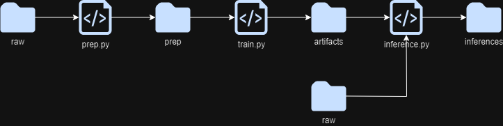

# Métodos de Gran Escala
## Objective
Este repositorio contiene el modelo para el predicción de precios de casas. Este proyecto busca hacer el pronóstico del precio de una casa dadas ciertas características del inmueble. Se desea tener un modelo completamente automatizado. Se escogió KNN por facilidad mas no por desempeño

## Data
Los datos utilizados son abiertos y se pueden encontrar en Kaggle:
https://www.kaggle.com/competitions/house-prices-advanced-regression-techniques

## Steps
- prep.py : Este script busca preparar los datos de entrenamiento
  - Carga los datos
  - Selecciona las columnas necesarias
  - Imputa la media en datos faltantes 
- training.py : Este script entrena y selecciona el mejor modelo de K vecinos más cercanos
  - Genera un scaler para uso futuro
  - Selecciona el mejor valor de k
  - Entrega un modelo entrenado
- inference.py : Este script realiza predicciones para un nuevo set de datos
  - Carga los datos nuevos
  - Le aplica el scaler precalculado
  - Le aplica el modelo
  - Regresa las predicciones
 
## Repository structure
src: contiene las funciones necesarias para el proyecto
data: aquí se almacenan los datos, el modelo, el scaler y las predicciones
notebooks: contiene el ejercicio inicial del desarrollo del modelo y el EDA

## Requisitos del sistema
Todo el proyecto se desarrolla en Python. En específico, se incluye el archivo de requirements.txt

## Flujo de ejecución

